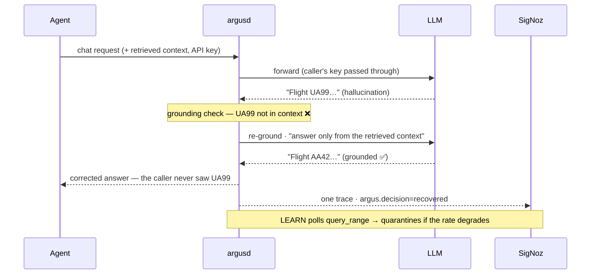

# Architecture

Argus is a single Go binary (`argusd`) that sits between an AI agent and its LLM provider as a drop-in,
OpenAI-compatible proxy. It adds two reflexes on the request path and reads its slow-loop decisions back
from SigNoz. This doc covers how a request flows, how each reflex works, and the boundaries that keep it
honest.

## One-sentence version

`argusd` proxies chat completions; **PREVENT** verifies each answer inline — blocking and re-grounding a
bad one before the caller sees it — while **LEARN** watches the windowed grounding rate *in SigNoz* and
quarantines a degrading model, rerouting live traffic to a healthy fallback.

## Request lifecycle

Every `POST /v1/chat/completions` runs the PREVENT path. Here is the interesting case — a hallucination
caught and recovered:

Step by step:

1. **Extract the caller's `traceparent`** so the agent → gateway → recovery spans render as one trace.
2. **Reroute if quarantined** — if LEARN has flagged the requested model, rewrite the request to the fallback.
3. **Forward upstream** with the caller's `Authorization` + provider headers (this is what makes it a real proxy).
4. **Grounding check** the answer against the `RETRIEVED_CONTEXT` carried in the request.
5. **Branch** on the outcome — one of five decisions, emitted as `argus.decision` on the span:

| decision | meaning | caller sees |
|---|---|---|
| `pass` | grounded on the first try | the answer |
| `recovered` | ungrounded → re-grounded successfully | the corrected answer |
| `refused` | ungrounded even after re-ground | a safe refusal |
| `upstream_error` | provider returned non-2xx | passed-through status / a safe refusal |
| `transport_error` | couldn't reach the provider | `502` |

The invariant, learned the hard way: **a failure must never render as a healthy success.** An upstream
error body carries no entity claims, so a naive grounding check would happily call it "grounded" and leave
the span green — argusd explicitly marks it `upstream_error` and skips the check. (See the `#25` and `#26`
regression tests in `internal/gateway`.)

## PREVENT — inline, deterministic, sub-millisecond

The grounding check (`internal/grounding`) is **entity-presence** verification: every identifier the answer
claims (regex `\b[A-Z]{2}\d{2,4}\b`, e.g. `AA42`) must appear in the `RETRIEVED_CONTEXT` the caller passed
in-band. Pure string work — no model, no network — so it runs in the request path in **~0.1 ms**.

- **Fail-open by design.** No context → skip the check. Blocking what we cannot verify would produce false
  positives, the one failure mode worse than the disease.
- **Re-ground.** On a block, argusd appends a system instruction ("your claim was unsupported; answer only
  from the retrieved context") and re-calls. A real model self-corrects; the caller only ever sees the fix.
- **Scope, stated honestly.** Entity-presence catches "cited something not in context" (including the
  exfiltration class), **not** general hallucination, and a **poisoned context defeats it**. The boundary
  is executable in `internal/grounding/exfil_corollary_test.go`.

## LEARN — windowed, through SigNoz, seconds

A single hallucination is a reflex problem; a model *slowly rotting* — quality decaying across many calls
while each still returns `200` — is an adaptation problem. LEARN (`internal/learn`) runs out of band:

1. Every ~2 s, query SigNoz `query_range` for the windowed grounding rate: `count()` of `argus.decision`
   spans grouped by decision over the last 30 s → `pass / (pass + recovered + refused)`. Infra errors are
   excluded — they are not behavioral drift.
2. Feed it to a **hysteresis governor** (`internal/health`): quarantine below 0.5, recover above 0.7, each
   confirmed over 2 evaluations so a transient dip doesn't flap the model in and out.
3. On a quarantine decision, install a reroute in the gateway; **PREVENT applies it on the very next request.**
4. A **staleness guard** refuses to act on data older than the freshness budget (`age = now − newest
   behavioral span`) — never act on stale truth.

Every step is itself a span (`argus.learn.evaluate`, `argus.learn.query_window`, `argus.learn.quarantine`),
so the observer is observed.

## The SigNoz boundary (ADR-0003)

The inviolable rule: **the synchronous request path never blocks on a SigNoz read.** PREVENT is local and
depends on nothing external — it cannot be slowed by ingestion or query latency. LEARN embraces the
seconds-scale window SigNoz is built for.

This split came from a *measured* reality: SigNoz ingestion + query latency is orders of magnitude above any
inline budget. The original "block the bad response in real time" design was a physics lie; measuring it
produced a stronger, more honest architecture — fast reflexes local, slow adaptation through observability.

## Telemetry model

- **Traces** — the agent span, the gateway `CLIENT` span (`chat {model}`), and the recovery `INTERNAL`
  span (`argus.recovery.reground`) share one `trace_id`, so each incident is a single waterfall. GenAI
  semantic conventions: `gen_ai.provider.name` (not the removed `gen_ai.system`), `input/output_tokens`,
  status left `UNSET` on success, `Error` + low-cardinality `error.type` on 5xx.
- **Metrics** — `argus_requests_total{model,decision,status_class}`, `argus_grounded_total{model}`, and
  observable gauges (`argus_intelligence_health_ratio`, `argus_infra_health_ratio`,
  `argus_cost_usd_per_request`). Labels are strictly low-cardinality; high-cardinality truth (prompts,
  ids) lives on spans, never on metric labels.
- **Resource** — one `service.instance.id` shared across the trace and metric providers, so SigNoz
  correlates both signals to the same process.

## Component map

| Package | Role |
|---|---|
| `cmd/argusd` | wiring: telemetry, gateway, LEARN poller, Mission Control, HTTP server |
| `internal/gateway` | the PREVENT path + the reroute actuator (implements `learn.Actuator`) |
| `internal/grounding` | the deterministic grounding check |
| `internal/learn` | the LEARN poller + the SigNoz `query_range` client |
| `internal/health` | the windowed health metric + the hysteresis governor |
| `internal/metrics` | the `argus_*` OpenTelemetry emitter |
| `internal/mission` | Mission Control — the status page + one chaos button |
| `internal/telemetry` | OTLP trace + metric providers, shared resource, W3C propagation |
| `agent/`, `mockllm/` | demo agent (Ada) + the deterministic replay engine |

Design decisions are recorded as ADRs in [`DECISIONS.md`](DECISIONS.md); the honest scoreboard of what was
proven (and how) is in [`proofs/SUMMARY.md`](proofs/SUMMARY.md).

## Roadmap (honest next steps)

- **Generalize grounding** beyond booking-style entity IDs — configurable patterns, or a pluggable checker
  (NLI / claim-support) run *off* the hot path so PREVENT stays sub-millisecond.
- **Cost governance** — enforce hard per-session spend caps inline, not just observe them.
- **Metric → trace exemplars** once running on a SigNoz version that stores them (argusd already emits
  them; the version we tested has no place to keep them — documented, not faked).
- **Zero-touch deploy** — a compose that bootstraps SigNoz and provisions the hero dashboard with no manual
  steps.
