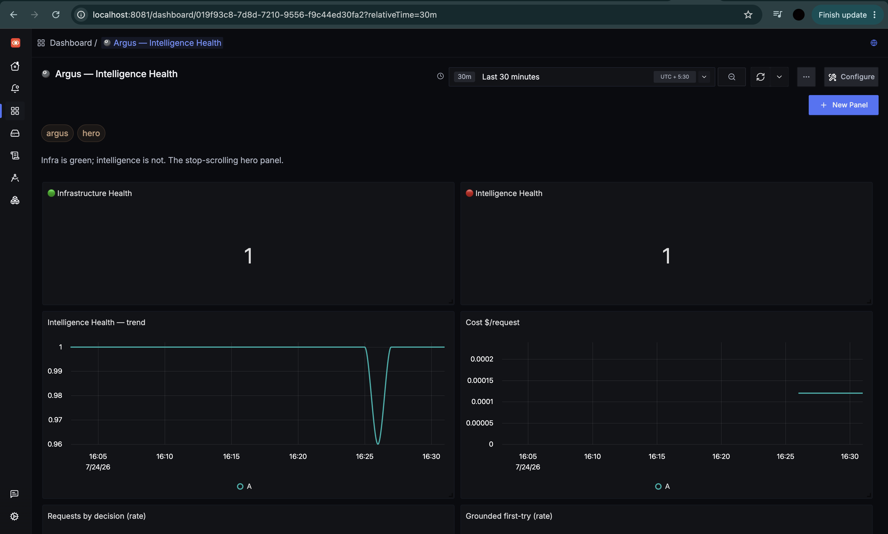

# Argus — The Immune System for AI Agents

> **AI infrastructure can be perfectly healthy while AI behavior is catastrophically wrong.**
> Argus detects the behavioral failures infra monitoring can't see — hallucinations, loops,
> runaway cost, exfiltration — and recovers before users notice.
>
> Built on OpenTelemetry. **SigNoz is its nervous system, not its dashboard.**

**Portkey breaks the circuit on errors. OpenLIT watches. Argus closes the loop on behavior.**

*Every server is green. Every request returns `200`. And the answers are quietly wrong. That gap —
🟢 infra healthy beside 🔴 intelligence collapsing — is where Argus lives.*

---

## The problem

Your monitoring watches the machine. **Nobody watches the mind.** An AI agent can return HTTP `200`
on every call while hallucinating, looping, or leaking data it was never given. Infra dashboards stay
green; your users get lied to. No error, no `500`, no alert in any normal tool.

## What Argus does — two capabilities

- **PREVENT** *(inline, milliseconds)* — a bad answer is caught in the request path by a deterministic
  grounding check, blocked, and re-grounded. The caller only ever sees the corrected answer. Depends
  on nothing external.
- **LEARN** *(windowed, through SigNoz, seconds)* — behavioral drift (quality falling while infra stays
  green) is detected from SigNoz telemetry, and the offending model is **quarantined and rerouted** to a
  healthy fallback.

Fast reflexes. Slow adaptation. An immune system.

## SigNoz is load-bearing, not decorative

LEARN keeps **no state of its own.** Every quarantine decision it makes, it reads back from SigNoz via
`query_range` — the windowed behavioral truth, computed *from* the telemetry SigNoz stores. **Turn
SigNoz off and Argus goes blind.** Most projects bolt an observability tool on as a dashboard; here it
is the control loop's sensory input. *(PREVENT stays inline and never blocks on SigNoz — ADR-0003.)*

## What works today — measured, live

Reproduce it yourself: `python demo/drive.py` (runbook: [`demo/README.md`](demo/README.md)).

- **PREVENT:** a hallucination (`UA99`) is caught and re-grounded **inline in 3.3 ms** — the caller
  received the correct `AA42`, never the bad answer.
- **LEARN:** sustained drift → **quarantine ~11 s → reroute → recover ~37 s**, with **0 non-200
  responses** across the entire arc. The `argus_intelligence_health_ratio` gauge traces a clean
  green → red → green while HTTP stays `200` the whole time.
- **Hero dashboard** on real `argus_*` metrics; **Mission Control** (one chaos button) served by the
  gateway; **P8 observability-quality** graded 🟢 against real emitted telemetry (correct GenAI semconv,
  low-cardinality metrics, complete resource, trace-linked recovery).

We built this proof-first — every architectural risk retired as a measurable proof before product code.
Live scoreboard: [`proofs/SUMMARY.md`](proofs/SUMMARY.md).

## Honest limits (we name them — that's what makes the rest credible)

- Grounding is **entity-presence** vs the retrieved context: it blocks emitting an identifier not in
  context (including the exfil class), **not** general prompt injection — and a **poisoned context
  defeats it** (boundary is in the test suite: `internal/grounding/exfil_corollary_test.go`).
- LEARN is a **windowed** loop (~11–37 s), not an instant snap — that's the honest cost of acting on a
  *behavioral* signal instead of an HTTP code.
- SigNoz stores no metric exemplars, so metric→trace click-through can't render — a platform limit; our
  telemetry emits them.

## Stack

Go gateway (`cmd/argusd`, one binary — PREVENT inline + LEARN poller + Mission Control) · Python demo
agent (`agent/`) + deterministic replay engine (`mockllm/`) · **SigNoz** (traces + metrics over OTLP) ·
OpenTelemetry throughout · Docker.

## Built for

The **Agents of SigNoz** hackathon — **Track 01: AI & Agent Observability**. See
[`WHY_NOW.md`](WHY_NOW.md) for why this is the moment.

## Repo map

[`VISION.md`](VISION.md) · [`DECISIONS.md`](DECISIONS.md) (ADRs) · [`KILL_LIST.md`](KILL_LIST.md) ·
[`TERMINOLOGY.md`](TERMINOLOGY.md) · [`DEMO_SCRIPT.md`](DEMO_SCRIPT.md) · [`demo/`](demo/) (runbook +
driver) · [`proofs/`](proofs/) (the de-risking harness) · [`JOURNAL.md`](JOURNAL.md).

## License

MIT — see [`LICENSE`](LICENSE).
